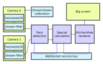

# ghost-protocol

This project is a REG hackweek project.

The goal is to show a "3D" image on a large display as it would appear from the viewers actual location in the space in front of the screen. The image should move as the viewer moves around. E.g. similar to the eye tracking display used in Mission Impossible - Ghost Protocol when they break into the Kremlin.

The steps will be:
1. Set up two cameras at two locations,
2. Stream the camera feeds to a device running an face detection model,
3. Identify location of persons head/eyes as pixel coordinates,
4. Use pixel coordiantes from both cameras to locate person in 3D space,
5. Adjust image on screen according to persons view point.

## Architecture

## Running

1. Start websocket server (see ./websocket-server).
1. Start a webserver to serve the Unity webGL build changing into the `./KitchenView/Builds/testbuild` directory and running something like `python3 -m http.server 8000`.
1. Having installed Racket, e.g. with HomeBrew, start the spatial-locator server as per the instructions in its README.
1. Start the face-detection server, with the [stream_face_results_to_ws.py](face_detection/stream_face_results_to_ws.py) script.
1. Locate the two phones, turn them on, SSH onto them and start the webservers that stream the video.